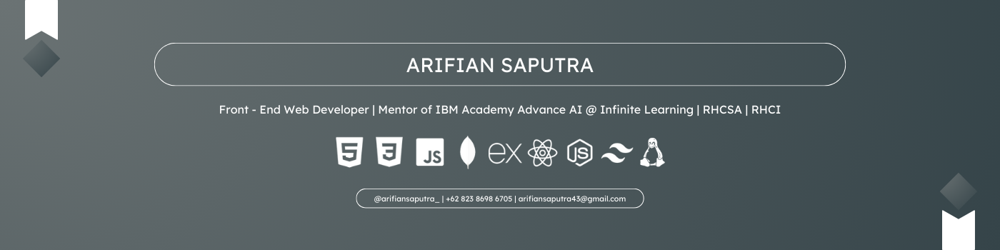

<h1 align="center">  Hello World! </h1>
<h5 align="center">  Welcome to my GitHub account, a place for all my works is here. </h5>

## 	What am I
- Currenlty stay as a Front - End Web Developer with a bit of Back - End knowledge.
- A Mentor of IBM Academy Advance AI @ [Infinite Learning](https://infinitelearning.id/)
- A Linux Certified System Administrator ([RHCSA](https://www.credly.com/badges/884a9063-1fa9-4371-9875-eb4db52fc428/public_url))
- Also an RHCI certified for mentoring RHCSA modules.
- Informatics Engineering student at [Raja Ali Haji Maritime University](https://umrah.ac.id/)

## Tech stack

## Find me at : 

       

## Github Stats

## Thanks for visiting !
