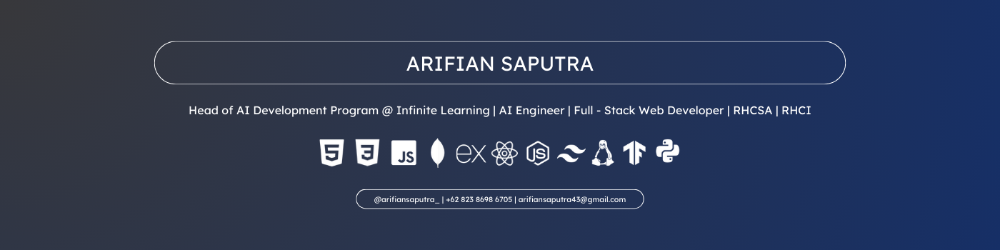

<h2 align="center">About</h2>

- 👋 Hello! My name is **Arifian**, a fresh graduate student of Informatics Engineering/Computer Science at Universitas Maritim Raja Ali Haji, Tanjungpinang, Riau Island.

- 💻 Skilled in Full Stack Web Development:
  - Front-end: React
  - Back-end: NodeJS, Flask

- 🤖 Proficient in AI Development:
  - Frameworks: TensorFlow, Keras, Sci-Kit, PyTorch
  - Language: Python

- 🎓 Currently serving as a **Head of AI Development Program** @ **[Infinite Learning](https://infinitelearning.id)** as a Technical Mentor.

- 🐧 Certified Linux Administrator:
  - Certification: RHEL (RHCSA)
  - Former Certified Instructor for Red Hat at **IBM Academy: Hybrid Cloud & AI** @ **Infinite Learning**, teaching and mentoring in advanced Linux administration.

<h2 align="center">Tech Stack</h2>

  
  

  
  
  
  

  
  
  

  

<h2 align="center">Social</h2>

  

  
  
  
  

  
  
  

<h2 align="center">GitHub Stats</h2>

  
  

  

<h3 align="center">Thanks for visiting!!</h3>
