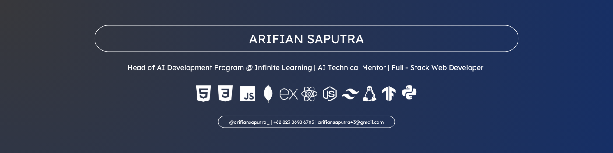

<h2 align="center">Arifian</h2>

Computer Science Graduate (2024) · AI Development · Technical Mentor

---

### About

- 🎓 Computer Science Graduate from Universitas Maritim Raja Ali Haji, Tanjungpinang, Riau Islands.
- 🤖 Currently serving as **Head of AI Development Program** @ **[Infinite Learning](https://infinitelearning.id)** as a Technical Mentor.
- 💻 Interested in Full Stack Web Development and AI Systems.

---

### Core Stack

**Web Development**
- React
- NodeJS
- Flask

**AI Development**
- Python
- TensorFlow
- Keras
- Scikit-Learn
- PyTorch

---

<h2 align="center">Tech Stack</h2>

  
  
  
  
  
  

---

### Connect

  <a href="https://www.github.com/arifian853">GitHub</a> ·
  <a href="https://www.linkedin.com/in/arifian-saputra-08135a178">LinkedIn</a> ·
  <a href="https://www.stackoverflow.com/users/13294082/arifian-saputra">StackOverflow</a> ·
  <a href="https://discord.com/users/AutumnNymph#9288">Discord</a>

---

  

---

Thanks for visiting.

