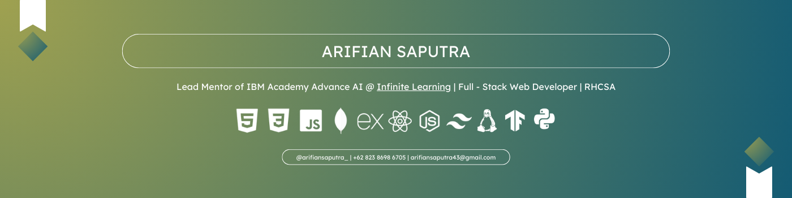

## Hi! I'm Arifian

## 	About: 
Hello! I am an undergraduate student of Informatics Engineering/Computer Science at Universitas Maritim Raja Ali Haji, Tanjungpinang, Riau Island.

I have skills in Full Stack Web Development with React, NodeJS, and Flask, as well as AI development with Keras, TensorFlow, and Python. Currently, I am an Advance AI mentor at IBM Academy @ Infinite Learning.

Additionally, I am a Certified Linux Administrator with RHEL (RHCSA) and have served as a Certified Instructor for RedHat at IBM Academy @ Infinite Learning, teaching and mentoring in advanced Linux administration and other technical skills.

## Tech stack : 

## Find me at : 

  

       

## Github Stats

## Thanks for visiting !
